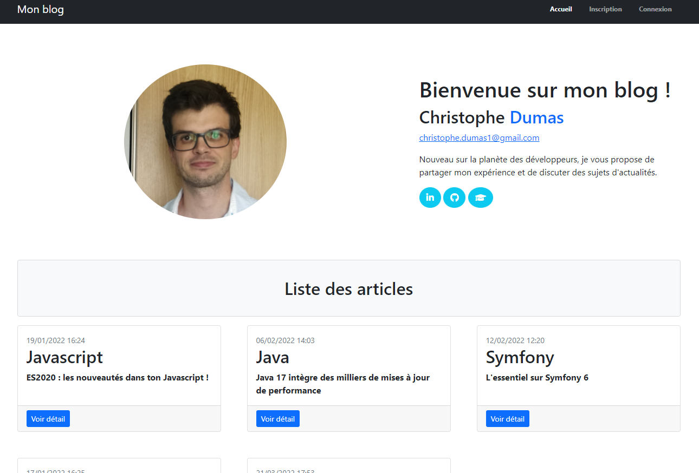

# Projet 5 - Parcours Développeur d'application - PHP / Symfony [](https://www.codacy.com/gh/chris496/ChristopheDumas_BlogPhp/dashboard?utm_source=github.com&amp;utm_medium=referral&amp;utm_content=chris496/ChristopheDumas_BlogPhp&amp;utm_campaign=Badge_Grade)

<p align="center">

</p>

## Getting Started &#x1F3C1;

* Ce site doit être exécuté en local (phase de développement)  

## Prerequisites &#x1F4DC;

* Apache (version utilisé : 2.4.46)  
* Php (version utilisé : 7.4.9)
* Mysql (version utilisé : 8.0.21) ou autre bdd sql
* Composer

## Installing &#x1F4BE;

* Installer Apache, Php et Mysql (pour ce projet j'ai utiliser Wamp)

* Cloner le projet git en local (se positionner dans le répertoire souhaité)

```bash
git clone https://github.com/chris496/ChristopheDumas_BlogPhp.git
```

* Importer la bdd qui se trouve dans le dossier database

* Dans un terminal, positionnez vous à la racine du projet et exécuter :

```bash
composer install
```

* Renommer le fichier .env_dist en .env puis entrer les données de votre bdd et de votre compte de messagerie

* executer le projet :

```bash
php -S localhost:8000
```

## Authors &#x1F60E;

* **Christophe Dumas** - [chris496](https://github.com/chris496)
